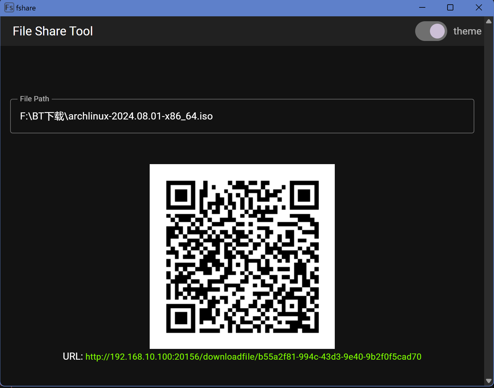

### fshare 应用

fshare 是一个简单的文件分享应用，通过输入文件地址生成分享链接，并通过 QR 码在局域网内的设备之间快速共享文件。该应用使用了以下技术栈：Tauri、Axum、Vue、Bun 和 Vite。

#### 主要功能
- 在输入框内输入文件地址，生成一个分享链接
- 使用 QR 码展示分享链接
- 允许局域网内的设备扫描 QR 码获取文件分享链接

#### 技术栈
- **Tauri**: 用于构建桌面应用程序的工具包，提供了跨平台的桌面应用开发能力。
- **Axum**: 基于 Rust 的 Web 框架，用于构建高性能的 Web 服务端应用。
- **Vue**: 一套用于构建用户界面的渐进式框架，使得构建交互式的 Web 界面更加便捷。
- **Bun**: 用于生成 QR 码的 Rust 库，可以方便地将文本信息转换为 QR 码。
- **Vite**: 一种新型前端构建工具，提供快速的开发体验和实时热更新。

#### 许可证
MIT 许可证

欢迎贡献代码、提出问题或改进建议。感谢您使用 fshare 应用！
## Recommended IDE Setup

- [VS Code](https://code.visualstudio.com/) + [Volar](https://marketplace.visualstudio.com/items?itemName=Vue.volar) + [Tauri](https://marketplace.visualstudio.com/items?itemName=tauri-apps.tauri-vscode) + [rust-analyzer](https://marketplace.visualstudio.com/items?itemName=rust-lang.rust-analyzer)
